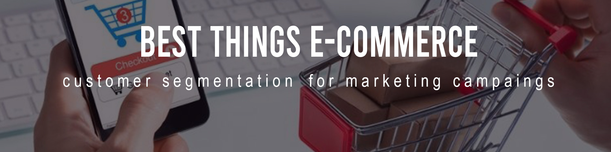

# Olá, seja bem vindo ao meu diretório. Para acessar o pipeline do projeto, clique na pasta "notebooks" e em seguida no arquivo "notebook.ipynb" :smiley:
# Insiders Clustering

Descobrindo grupos similares de clientes para a criação de um programa de fidelidade com ações personalizadas, focadas em cada grupo de clientes, dadas as suas particularidades e valores para a empresa.

#### This project was made by Samoel de Moura.

# 1. Problema de Negócio

# 2. Premissas

# 3. Planejamento da Solução

## 3.1 Input (Entrada)
1. Problema de Negócio:
    - Selecionar os clientes mais valiosos para integrar um programa de fidelização (**Insiders**)
2. Conjunto de Dados:
    - Vendas de um e-commerce online, durante o período de um ano.
    
## 3.2 Output (Saída)
1. A indicação das pessoas que farão parte do programa de insiders
**(EXEMPLO)**

    -                client_id | is_insider
                         10001 | yes
                         10002 | no
                           ... | yes
 
## 3.3 Tasks (Tarefas)
1. Quais são as pessoas elegíveis para participar do programa de Insiders?
    - O que é ser elegível? O que são clientes de maior valor?
        - Faturamento:
            - Alto Ticket Médio
            - Alto LTV (Life time value)
            - Alto Basket Size (número de produtos por ticket)
            - Baixa Recência
            - Baixa probabilidade de churn (deixar de comprar da empresa)
            - Alta previsão de LTV
            - Alta propensão de compra
        - Custo:
            - Baixa taxa de devolução
        - Experiência de compra:
            - Média alta das avaliações
2. Quantos clientes farão parte do grupo?
    - Número de clientes
    - Porcentagem em relação ao total de clientes
3. Quais as principais características desses clientes?
    - Escrever os principais atributos dos clientes, exemplo:
        - idade
        - gênero
        - localização
        - salário
4. Qual a porcentagem de contribuição para o faturamento total da empresa?
    - Após definir o grupo Insiders, demonstrar a sua porcentagem de contribuição.
5. Qual a espectativa de faturamento desse grupo para os próximos meses?
    - Criar um modelo de predição de faturamento, identificar o melhor modelo e fazer predições.
6. Quais as condições para uma pessoa ser elegível para o programa de Insiders?
    - Qual período de avaliação?
    - O desempenho do cliente está próximo do desempenho do grupo Insiders?
7. Quais as condições para uma pessoa ser removida do programa?
    - Qual período de avaliação?
    - O desempenho do cliente está distante do desempenho do grupo Insiders?
8. Qual a garantia que o programa Insiders é melhor que o restante da base?
    - Teste A/B
    - Demonstrar o melhor ponto da curva de contribuição/porcentagem da base
9. Quais ações o time de marketing pode realizar para aumentar o faturamento?
    - Descontos
    - Frete grátis
    - Pontuação (exemplo Mercado Pontos do Mercado Livre)

# 4. Top 3 Data Insights

# 5. Machine Learning Model Aplicado

# 6. Machine Learning Modelo Performance

# 7. Resultados de Negócio

# 8. Conclusão

# 9. Aprendizados

# 10. Próximos Passos

# 11. Deploy

# 12. Status do Projeto

