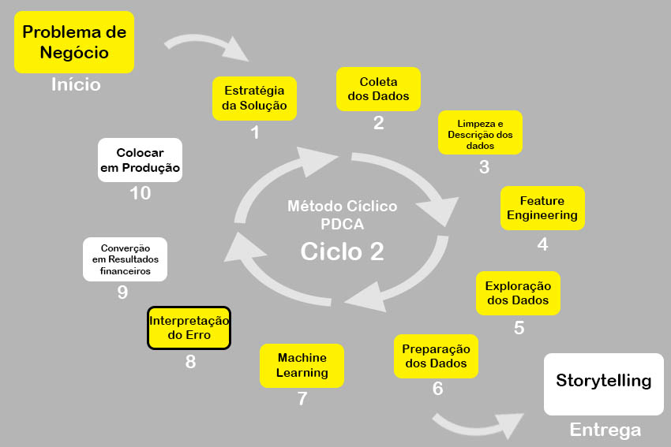

# Insiders Clustering

Descobrindo grupos similares de clientes para a criação de um programa de fidelidade com ações personalizadas, focadas em cada grupo de clientes, dadas as suas particularidades e valores para a empresa.

#### This project was made by Samoel de Moura.

# 1. Problema de Negócio

# 2. Premissas

# 3. Planejamento da Solução

# 4. Top 3 Data Insights

# 5. Machine Learning Model Aplicado

# 6. Machine Learning Modelo Performance

# 7. Resultados de Negócio

# 8. Conclusão

# 9. Aprendizados

# 10. Próximos Passos

# 11. Deploy

# 12. Status do Projeto

